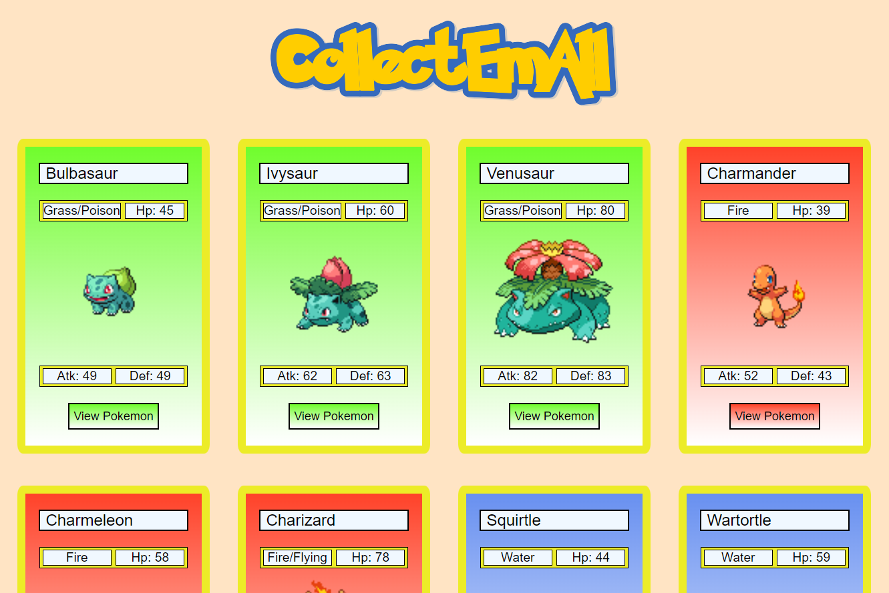
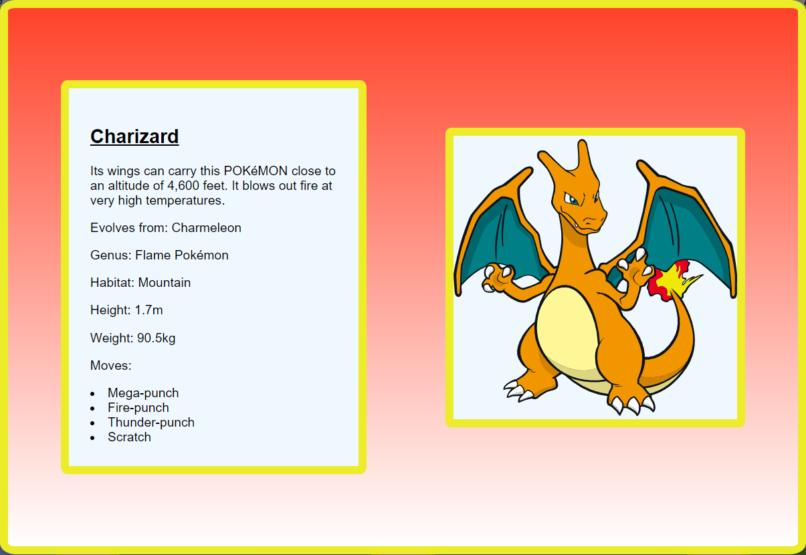

# CollectEmAll

## Description

Immerse yourself in the world of Pokémon with this sleek React FrontEnd application. Seamlessly powered by the PokeAPI, it effortlessly showcases comprehensive information about the iconic first generation of Pokémon. Includes meticulously crafted unit and integration tests, an intuitively responsive design, captivating animations, dynamic state management, dynamic styles, React hooks, and thoughtfully implemented helper functions. Explore the Pokémon universe like never before with this elegantly designed and meticulously crafted application.

## Demo

[CollectEmAll](https://cullsgit.github.io/collectemall/)

## Technologies Used

- React.JS
- JavaScript ES6
- CSS
- Node
- Jest
- React testing library
- Github pages

## List Page:

## View Page:

# Enjoy!
